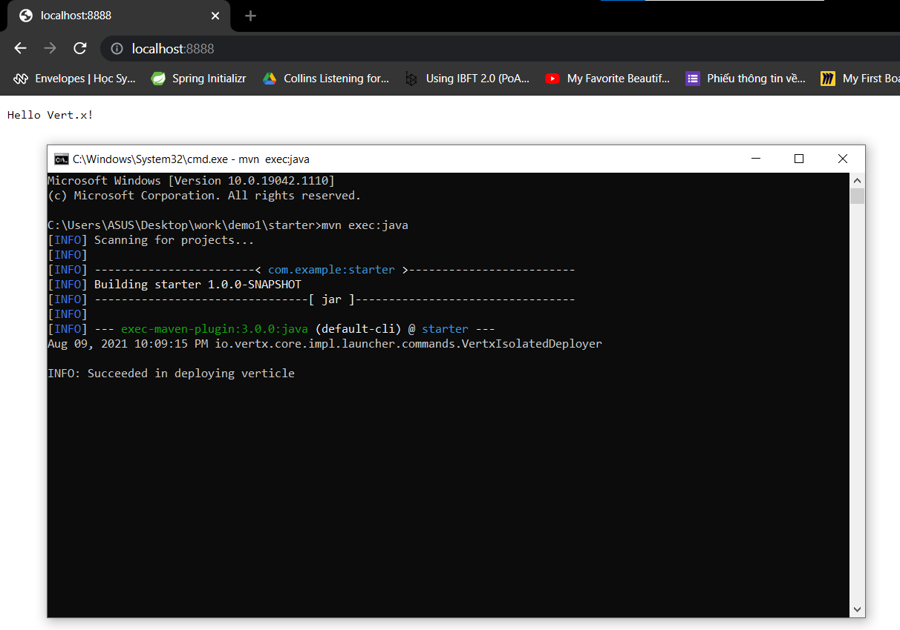
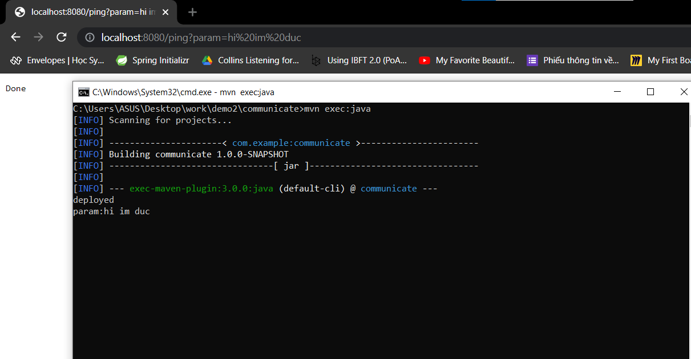
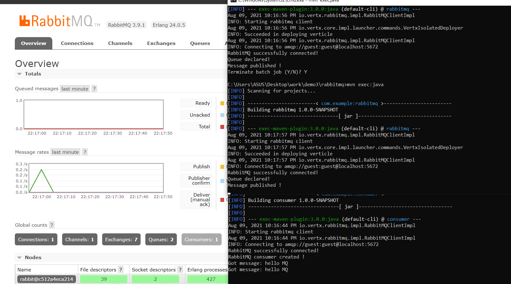

# vertx
# demo1: # 
Tạo http server

# demo2: #
Một verticle nhận param từ trình duyệt, gửi cho param verticle khác qua EventBus in ra màn hình console.

# demo3: #
Một verticle gửi vào queue, verticle còn lại consume và in ra console

